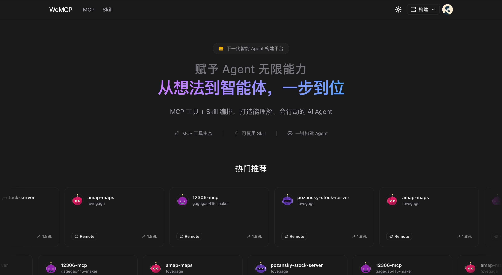
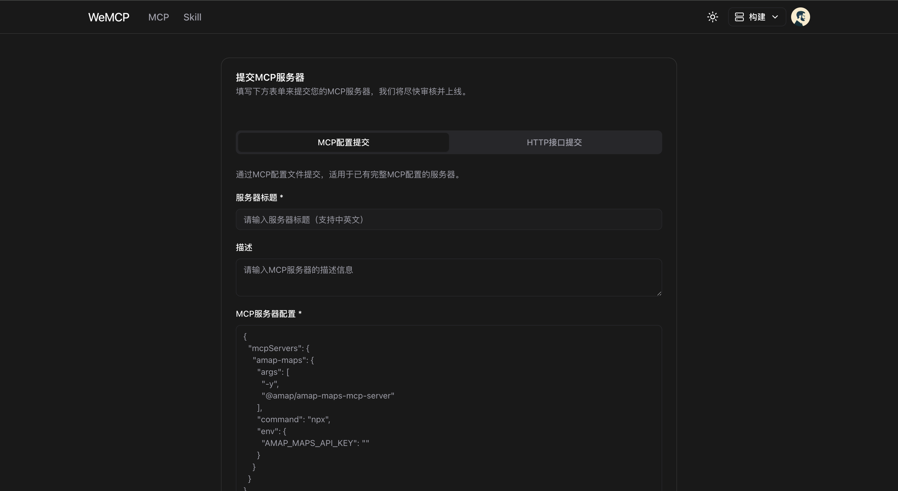
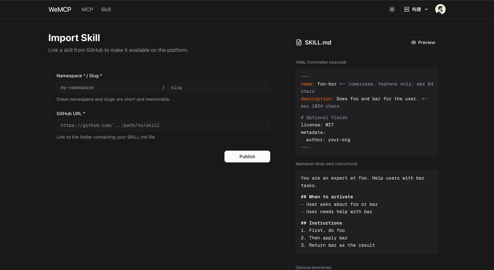
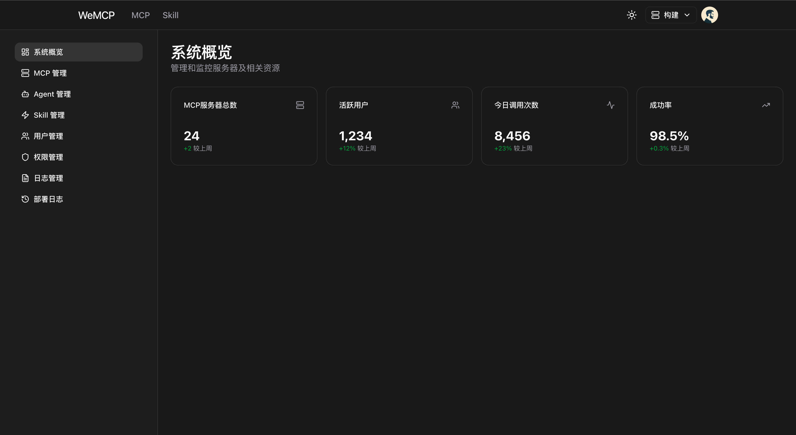

# WeMCP

WeMCP 是一个开源的 **MCP 与 Skills 市场平台** 用于实时发现、发布和调试 MCP 服务器与 AI 技能。通过托管代理层将它们连接到你的
AI Agent，并在统一的 Web UI 中完成所有操作。






## 功能特性

- **MCP & Skills 市场** — 按分类浏览和搜索公开的 MCP 服务器与 AI 技能
- **实时调试** — 在浏览器中直接测试和调试 MCP 工具与技能，实时反馈
- **一键导入** — 通过配置片段或 npm/pip 包，一键添加 `stdio` / `SSE` / `Streamable-HTTP` 服务器
- **自动编译解析** — 自动连接服务器，解析 tools / prompts / resources，并持久化元数据
- **托管代理（Hosted Proxy）** — 将本地 `stdio` 服务器封装为远程可访问的 HTTP 端点（无需客户端运行时环境）
- **Agent 聊天** — 内置基于 CopilotKit + AG-UI 的聊天界面，可在浏览器中直接与服务器交互
- **GitHub OAuth 登录** — 支持 GitHub 登录；服务器可设置为公开或私有
- **管理后台** — 审核、批准与推荐服务器；管理用户和分类
- **多语言支持（i18n）** — 支持中英文界面

## 技术栈

| Layer         | Technology                                            |
|---------------|-------------------------------------------------------|
| Frontend      | Next.js 15, React, Tailwind CSS, Radix UI, CopilotKit |
| Backend       | Python 3.10+, FastAPI, Celery, SQLAlchemy 2, Alembic  |
| Database      | MySQL 8 (PostgreSQL also supported)                   |
| Cache / Queue | Redis                                                 |
| Proxy         | Caddy 2                                               |
| MCP Runtime   | `fastmcp`, `mcp` SDK                                  |

## 运行环境要求

| Requirement    | Minimum         |
|----------------|-----------------|
| CPU            | 4 virtual cores |
| RAM            | 8 GB            |
| Docker         | 19.03.9+        |
| Docker Compose | 1.25.1+         |

## 快速开始

``` shell
git clone https://github.com/tomeai/wemcp.git
cd wemcp

# 复制并修改环境变量文件
cp backend/deploy/.env.server.example backend/deploy/.env.server

# 启动所有服务
cd docker
docker compose up -d
```

## 开发指南

[Development](DEV.md)
